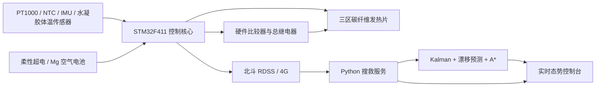

# 系统架构

## 分层

## 装备端

装备端按 10 ms 控制周期执行以下顺序：

1. 读取核心体温、表面温度、环境温度和 IMU 姿态。
2. 更新模式分类器，得到活动、静止或昏迷状态。
3. 对目标体温误差执行增益调度 PID。
4. 按胸部、背部、腰部比例分配占空比。
5. 检查表面温度和硬件比较器，执行过热闭锁。
6. 由能源策略计算电容、电池、混合或预热状态。
7. 输出 PWM、继电器和状态遥测。
8. 复位独立看门狗。

`firmware/core/` 与硬件无关，可以在主机测试。`firmware/stm32f411/` 只负责采样、外设和故障联锁。

## 服务端

`FleetService` 同时支持模拟设备和外部遥测：

- `POST /api/v1/telemetry` 接收装备遥测。
- 卡尔曼滤波器输出平滑位置。
- 告警管理器按设备执行 30 秒重发和确认门控。
- 漂移预测器用海流、风和风阻系数生成 1 至 6 小时位置带。
- A* 规划器把海流与风作为方向性阻力，输出救援航路和 ETA。
- 优先级评分综合告警、体温下降、能源余量和静止时长。

## 替换边界

| 参考实现 | 生产替换 |
| --- | --- |
| 规则模式分类器 | 随机森林或轻量神经网络以 ONNX 部署 |
| 物理漂移基线 | LSTM 或业务海况模型 |
| 简化 SOH 估算 | 电压、电流、温度和循环次数 SVM |
| 内存设备表 | MQTT、时序数据库和持久化事件队列 |
| 单向 HTTP 接口 | TLS、设备证书、消息重放保护和审计 |

